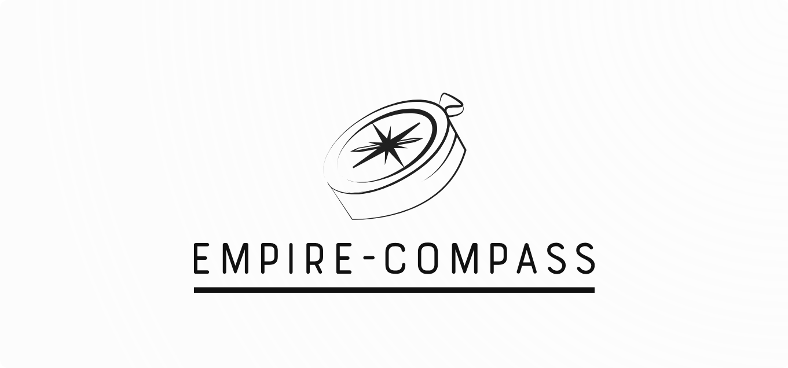

<!-- PROJECT LOGO -->
 

  

<h2 align="center">EmpiRE-Compass 
<i>"Navigating the EmpiRE of Empirical Research in Requirements Engineering"</i></h2>

# About the Project
EmpiRE-Compass is a dashboard for exploring the state and evolution of empirical research in requirements engineering using KG-EmpiRE.
