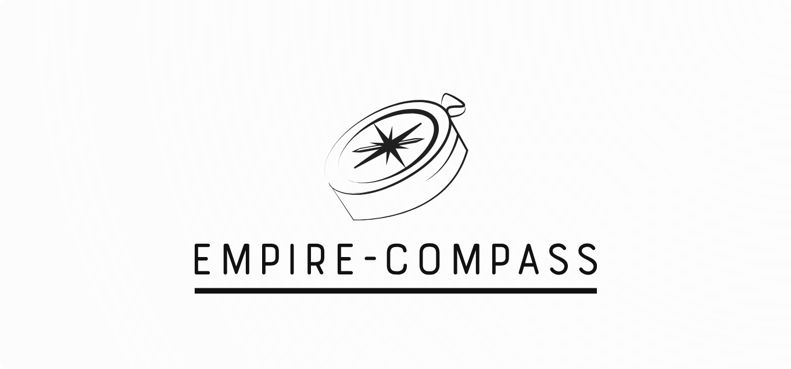

<a id='top'></a>

<div align="center">
  <a href="https://github.com/okarras/EmpiRE-Compass">
    
  </a>

<h2 align="center" style="font-weight: normal">EmpiRE-Compass<br/>
<i>"Navigating the Landscape of Empirical Research in Requirements Engineering"</i></h2><br/>

[](https://github.com/okarras/EmpiRE-Compass) [](https://github.com/okarras/EmpiRE-Compass/issues) [](LICENSE)

</div>

# Table of Contents

<details>
  <summary>Contents</summary>
  <ol>
    <li><a href="#overview">Overview</a></li>
    <li><a href="#key-features">Key Features</a></li>
    <li>
      <a href="#getting-started">Getting Started</a>
      <ol>
        <li><a href="#prerequisites">Prerequisites</a></li>
        <li><a href="#installation">Installation</a></li>
      </ol>
    </li>
    <li><a href="#usage">Usage</a></li>
    <li><a href="#design-system--storybook">Design System & Storybook</a></li>
    <li><a href="#firebase-setup">Firebase Setup</a></li>
    <li><a href="#statistics-automation">Statistics Automation</a></li>
    <li><a href="#license">License</a></li>
    <li><a href="#repository-links">Repository Links</a></li>
  </ol>
</details>

# About the Project

EmpiRE-Compass is a **neuro-symbolic dashboard** that facilitates the exploration, replication, and reuse of empirical research knowledge from **KG-EmpiRE** – a community-maintainable knowledge graph on the state and evolution of empirical research in requirements engineering (RE). By leveraging live data from KG-EmpiRE stored in the [Open Research Knowledge Graph (ORKG)](https://orkg.org), EmpiRE-Compass offers researchers a suite of tools for **data visualization**, **comparative analysis**, and **structured data contribution**.

The platform serves as a **central hub for empirical research data management**. It provides interactive diagrams connected to live ORKG data, supports reproducibility and comparison of different KG-EmpiRE states, displays statistics on conferences and papers, and includes a survey-based data contribution workflow for new research submissions. An integrated **Study Designer Knowledge Base** helps users find similar research and receive design recommendations aligned with ACM standards.

The project includes a comprehensive **Storybook design system** that documents all UI components, making it easy for developers to understand, reuse, and contribute to the component library.

Key capabilities include:

1. **Dashboard Display** – Visualizes 16 competency questions and their answers with interactive diagrams, providing an overview of KG-EmpiRE data.
2. **Live Interactive Diagrams** – Dynamically fetches real-time data from ORKG. Users can click diagram elements to explore related research papers and insights.
3. **Reproduction & Comparison** – Allows reviewing historical published states of KG-EmpiRE and comparing them with the current live data to understand how research evolves.
4. **Statistics & Metrics** – Displays real-time counts of conferences, papers, triples, resources, and literals to keep track of the KG-EmpiRE scope.
5. **Data Contribution Workflow** – Includes a survey system for structured empirical research data submissions (paper DOIs, contact details, etc.), which undergo curator approval before being integrated into ORKG.
6. **Study Designer Knowledge Base** – Helps users identify similar studies and provides design recommendations based on existing empirical research and ACM standards.

<p align="right">(<a href="#top">back to top</a>)</p>

# Folder Structure and Files

In the following, we first show a graphical overview of the folder structure and files of the project before we describe them in more detail.

## Graphical Overview

```
EmpiRE-Compass/
┣━ .github/
┃   ┗━ workflows/
┃       ┗━ update-statistics.yml
┣━ .husky/
┃   ┣━ _/
┃   ┣━ commit-msg
┃   ┗━ pre-commit
┣━ .idea/
┣━ .storybook/
┃   ├── main.ts
┃   ├── preview.ts
┃   └── vitest.setup.ts
┣━ data/
┃   ├── questions.json
┃   ├── sample_data.json
┃   ├── query_1_data_2024-07-26.json
┃   ├── query_2.1_data_2024-07-26.json
┃   ├── query_6.1_data_2024-07-26.json
┃   ├── query_10_data_2025-02-27.json
┃   ├── query_11_data_2025-02-27.json
┃   ├── query_12_data_2025-02-27.json
┃   ├── query_13_data_2025-02-27.json
┃   ├── query_14_data_2025-02-27.json
┃   ├── query_15.1_data_2025-02-27.json
┃   ├── query_15.2_data_2025-02-27.json
┃   ├── query_4.1_data_2025-02-27.json
┃   ├── query_4.2_data_2025-02-27.json
┃   ├── query_5_data_2025-02-27.json
┃   ├── query_7.1_data_2025-02-27.json
┃   ├── query_8_data_2025-02-27.json
┃   └── query_9_data_2025-02-27.json
┣━ dev-dist/
┃   ├── registerSW.js
┃   ├── sw.js
┃   └── workbox-6244ca5c.js
┣━ docs/
┃   ├── CONTRIBUTING.md
┃   ├── FIREBASE_QUICK_SETUP.md
┃   ├── FIREBASE_SETUP.md
┃   ├── GITHUB_FIREBASE_SETUP.md
┃   ├── STORYBOOK_PUBLISHING.md
┃   └── VERSIONING.md
┣━ empire-compass-dashboard/
┃   └── src/ (macOS .DS_Store files)
┣━ scripts/
┃   ├── empire-statistics.py
┃   ├── firebase_integration.py
┃   ├── firebase-service-account.json.template
┃   ├── daily_results_incremental.csv
┃   ├── requirements.txt
┃   ├── update_statistics_dummy.txt
┃   └── orkg-cache/
┃       ├── .gitkeep
┃       ├── <many cached ORKG *.json files> …
┃       └── (hundreds of hashed cache entries)
┣━ src/
┃   ├── api/
┃   │   ├── SPARQL_QUERIES.ts
┃   │   └── STATISTICS_SPARQL_QUERIES.ts
┃   ├── assets/
┃   │   ├── KGEmpire.png
┃   │   ├── ORKG.png
┃   │   ├── ORKGask.png
┃   │   └── TIB.png
┃   ├── components/
┃   │   ├── AI/
┃   │   │   ├── AIAssistant.tsx
┃   │   │   ├── AIConfigurationButton.tsx
┃   │   │   ├── AIConfigurationDialog.tsx
┃   │   │   ├── AIContentGenerator.tsx
┃   │   │   ├── ChatMessage.tsx
┃   │   │   ├── CodeBlock.tsx
┃   │   │   ├── DynamicQuestionManager.tsx
┃   │   │   ├── FloatingAIAssistant.tsx
┃   │   │   ├── HistoryManager.tsx
┃   │   │   ├── HTMLRenderer.tsx
┃   │   │   ├── InitialAnalysis.tsx
┃   │   │   ├── InteractiveSection.tsx
┃   │   │   ├── LLMContextHistoryDialog.tsx
┃   │   │   ├── MessageContent.tsx
┃   │   │   ├── ReasoningSection.tsx
┃   │   │   ├── ResponseDisplay.tsx
┃   │   │   ├── SPARQLQuerySection.tsx
┃   │   │   └── TextSkeleton.tsx
┃   │   ├── CustomCharts/
┃   │   │   ├── ChartParamsSelector.tsx
┃   │   │   ├── ChartTypeSelector.tsx
┃   │   │   ├── ChartWrapper.tsx
┃   │   │   ├── CustomBarChart.tsx
┃   │   │   ├── CustomGaugeChart.tsx
┃   │   │   ├── CustomPieChart.tsx
┃   │   │   └── StatsChartTypeSelector.tsx
┃   │   ├── Home/
┃   │   │   ├── AboutProject.tsx
┃   │   │   ├── Contact.tsx
┃   │   │   ├── FutureDevelopment.tsx
┃   │   │   ├── Header.tsx
┃   │   │   └── KeyFeatures.tsx
┃   │   ├── Layout pieces (Header.tsx, MenuDrawer.tsx, ScrollTop.tsx)
┃   │   ├── Question*.tsx (Question, Dialog, Accordion, Views)
┃   │   ├── Dashboard.tsx
┃   │   ├── CustomGrid.tsx
┃   │   ├── ErrorState.tsx
┃   │   ├── LoadingState.tsx
┃   │   ├── SectionSelector.tsx
┃   │   ├── StatCard.tsx
┃   │   └── StatisticsPageLoadingSkeleton.tsx
┃   ├── constants/
┃   │   ├── data_processing_helper_functions.ts
┃   │   └── queries_chart_info.ts
┃   ├── context/
┃   │   ├── AIAssistantContext.tsx
┃   │   └── DynamicQuestionContext.tsx
┃   ├── contexts/ (ThemeContext.tsx)
┃   ├── firestore/
┃   │   ├── CRUDQuestions.ts
┃   │   └── CRUDStatistics.ts
┃   ├── helpers/
┃   │   ├── fetch_query.ts
┃   │   ├── query.ts
┃   │   └── statistics_calculator.ts
┃   ├── hooks/ (useAIAssistant.ts)
┃   ├── pages/
┃   │   ├── DynamicQuestionPage.tsx
┃   │   ├── QuestionDashboardPage.tsx
┃   │   ├── QuestionPage.tsx
┃   │   ├── Statistics.tsx
┃   │   ├── Home.tsx
┃   │   ├── Layout.tsx
┃   │   ├── ErrorFallback.tsx
┃   │   └── NotFound.tsx
┃   ├── prompts/ (GENERATE_SPARQL.txt)
┃   ├── services/ (aiService.ts)
┃   ├── store/
┃   │   ├── hooks.ts
┃   │   ├── index.ts
┃   │   └── slices/
┃   │       ├── aiSlice.ts
┃   │       └── questionSlice.ts
┃   ├── styles/ (global.css)
┃   ├── types/ (chart.d.ts)
┃   ├── utils/ (theme.ts)
┃   ├── App.tsx
┃   ├── Router.tsx
┃   ├── firebase.ts
┃   ├── main.css
┃   ├── main.tsx
┃   └── vite-env.d.ts
┣━ stories/
┃   ├── AI/ …
┃   ├── DataVisualization/ …
┃   ├── Home/ …
┃   ├── Layout/ …
┃   ├── Questions/ …
┃   └── Utility/ …
┣━ docs/ (see above)
┣━ index.html
┣━ logo.png
┣━ LICENSE
┣━ README.md
┣━ package.json
┣━ package-lock.json
┣━ tsconfig*.json
┣━ vercel.json
┣━ vite.config.ts
┣━ vitest.*.d.ts
┗━ CHANGELOG.md, .prettierrc, eslint.config.js, commitlint.config.cjs, .env, .gitignore
```

## Description of the Folders and Files

| **Directory / File**                                         | **Description**                                               |
| ------------------------------------------------------------ | ------------------------------------------------------------- |
| [.storybook/](.storybook/)                                   | Storybook configuration files used to document UI components. |
| [.storybook/main.js](.storybook/main.js)                     | Main Storybook configuration (addons, stories).               |
| [.storybook/preview.js](.storybook/preview.js)               | Global settings, decorators, and parameters for Storybook.    |
| [.storybook/manager.js](.storybook/manager.js)               | Custom Storybook UI configuration.                            |
| [public/](public/)                                           | Static files served by the app.                               |
| [public/logo.png](public/logo.png)                           | Logo of the project.                                          |
| [src/assets/](src/assets/)                                   | Contains static project assets.                               |
| [src/assets/images/](src/assets/images/)                     | Image files for UI.                                           |
| [src/assets/styles/](src/assets/styles/)                     | CSS/SCSS files for asset styling.                             |
| [src/components/](src/components/)                           | All reusable and page-specific components.                    |
| [src/components/Dashboard/](src/components/Dashboard/)       | Components for dashboard display.                             |
| [src/components/Charts/](src/components/Charts/)             | Chart.js and diagram components.                              |
| [src/components/Forms/](src/components/Forms/)               | Form components for data input.                               |
| [src/components/Shared/](src/components/Shared/)             | Shared UI elements like buttons and modals.                   |
| [src/hooks/](src/hooks/)                                     | Custom React hooks for reusable logic.                        |
| [src/hooks/useFetchData.js](src/hooks/useFetchData.js)       | Data fetching logic for ORKG queries.                         |
| [src/hooks/usePagination.js](src/hooks/usePagination.js)     | Hook for pagination logic.                                    |
| [src/pages/](src/pages/)                                     | Page-level React components for routing.                      |
| [src/pages/HomePage.js](src/pages/HomePage.js)               | Landing page.                                                 |
| [src/pages/DashboardPage.js](src/pages/DashboardPage.js)     | Dashboard overview page.                                      |
| [src/pages/StatisticsPage.js](src/pages/StatisticsPage.js)   | Statistics visualization page.                                |
| [src/services/](src/services/)                               | Service layer for API interactions.                           |
| [src/services/api.js](src/services/api.js)                   | Base API setup.                                               |
| [src/services/orkgService.js](src/services/orkgService.js)   | ORKG-specific API requests.                                   |
| [src/store/](src/store/)                                     | Global state management with Zustand.                         |
| [src/store/comparisonStore.js](src/store/comparisonStore.js) | Zustand store for comparisons.                                |
| [src/styles/](src/styles/)                                   | Global style definitions.                                     |
| [src/styles/globals.css](src/styles/globals.css)             | Base global styles.                                           |
| [src/styles/theme.css](src/styles/theme.css)                 | Theme definitions and color variables.                        |
| [src/tests/](src/tests/)                                     | Unit and integration tests.                                   |
| [src/tests/App.test.js](src/tests/App.test.js)               | Main app test.                                                |
| [src/tests/utils.test.js](src/tests/utils.test.js)           | Utility function tests.                                       |
| [src/utils/](src/utils/)                                     | Helper functions.                                             |
| [src/utils/fetchData.js](src/utils/fetchData.js)             | Fetch data helper.                                            |
| [src/utils/formatData.js](src/utils/formatData.js)           | Data formatting helper.                                       |
| [src/index.js](src/index.js)                                 | Entry point for the React app.                                |
| [.gitignore](.gitignore)                                     | Git ignore rules.                                             |
| [package.json](package.json)                                 | Project dependencies and scripts.                             |
| [README.md](README.md)                                       | Project documentation.                                        |
| [LICENSE](LICENSE)                                           | Project license.                                              |
| [yarn.lock](yarn.lock)                                       | Dependency lockfile for Yarn.                                 |

<p align="right">(<a href="#top">back to top</a>)</p>

# Installation Instructions

In the following, we explain how to install and run the project locally using a terminal, assuming that the prerequisites are met.

## 1. Ensure prerequisites are installed

- **Node.js** (version 14 or higher)
- **Modern web browser** (e.g., Chrome, Firefox)
- **Git** (optional, for version control)

## 2. Clone the repository

```sh
git clone https://github.com/okarras/EmpiRE-Compass.git
```

## 3. Navigate to the main project directory

```sh
cd EmpiRE-Compass
```

## 4. Install dependencies

Using **npm**:

```sh
npm install
```

or using **yarn**:

```sh
yarn install
```

## 5. Start the development server

Using **npm**:

```sh
npm start
```

or using **yarn**:

```sh
yarn start
```

## 6. Open the application in your browser

Visit:

```
http://localhost:3000
```

<p align="right">(<a href="#top">back to top</a>)</p>

# Usage Instructions

The dashboard offers an immediate view of **16 competency questions** with their answers and corresponding diagrams.  
Users can:

- Interact with diagrams to navigate empirical research data and discover relevant papers from ORKG.
- Reproduce and compare historical states of KG-EmpiRE to monitor data evolution.
- View up-to-date metrics such as the number of conferences, papers, and triples on the statistics page.
- Submit new data via a survey (including paper DOIs and research details) for curator review.
- Use the **Study Designer Knowledge Base** to find similar research and receive design recommendations aligned with ACM standards.

<p align="right">(<a href="#top">back to top</a>)</p>

# Design System & Storybook

EmpiRE-Compass includes a comprehensive design system documented in Storybook, providing a complete library of reusable UI components.

## 📚 **Storybook (Component Library)**

**Live Documentation**: [https://your-storybook-url.chromatic.com](https://your-storybook-url.chromatic.com) <!-- TODO: Update with actual Storybook URL -->

## **Component Categories**

- **🏠 Home Components**: Hero sections, feature highlights, contact forms
- **📊 Data Visualization**: Custom charts, statistics cards, interactive graphs
- **🤖 AI Components**: AI assistant interface, chat messages, dynamic questions
- **🔧 Layout Components**: Headers, navigation, responsive containers
- **⚙️ Utility Components**: Loading states, error handling, form elements

## **Technology Stack**

- **React 18** with TypeScript
- **Material-UI** component library
- **Storybook 7** for documentation
- **Chromatic** for visual testing (planned)

## **Local Development**

```bash
# Start Storybook locally
npm run storybook

# Build Storybook for deployment
npm run build-storybook

# Preview built Storybook
npm run preview:storybook
```

## **Deployment to Chromatic**

```bash
# Deploy to Chromatic (requires CHROMATIC_PROJECT_TOKEN)
npm run deploy:chromatic

# Set up Chromatic project token as environment variable
export CHROMATIC_PROJECT_TOKEN=your-token-here
```

**Setup Instructions:**

1. Sign up at [chromatic.com](https://chromatic.com)
2. Create a new project for EmpiRE-Compass
3. Get your project token from the Chromatic dashboard
4. Add the token to your environment variables
5. Run `npm run deploy:chromatic` to publish your Storybook
6. Update the URLs in `Header.tsx` and `README.md` with your Chromatic URL

## **Features**

- 📖 **Interactive Documentation** - Live component examples with controls
- 🎨 **Design Tokens** - Consistent colors, typography, and spacing
- ♿ **Accessibility Testing** - Built-in a11y checks
- 📱 **Responsive Design** - Mobile-first component library
- 🔧 **Developer Tools** - Props controls and code examples

# Firebase Setup

EmpiRE-Compass uses Firebase for real-time statistics storage and automatic data updates. Follow these guides to set up Firebase integration:

## Quick Setup (5 minutes)

📋 **[Firebase Quick Setup Guide](docs/FIREBASE_QUICK_SETUP.md)** - Fast-track setup with essential steps

## Detailed Setup

📖 **[Complete Firebase Setup Guide](docs/GITHUB_FIREBASE_SETUP.md)** - Comprehensive guide with troubleshooting

## Firebase Configuration Steps:

1. **Create Firebase Project** - Set up a new project in Firebase Console
2. **Generate Service Account** - Download the service account JSON key
3. **Configure GitHub Secret** - Add `FIREBASE_SERVICE_ACCOUNT_KEY` to repository secrets
4. **Test Integration** - Run the workflow to verify everything works

## Local Development

```bash
# Validate your Firebase JSON file
cd scripts
python validate_firebase_json.py path/to/your/service-account.json

# Test Firebase integration
python firebase_integration.py

# Run statistics update locally
python empire-statistics.py --service_account path/to/service-account.json --limit 5
```

# Statistics Automation

EmpiRE-Compass automatically updates statistics using GitHub Actions that run the `empire-statistics.py` script:

## Automated Updates

- **On every commit** to main branch
- **On merged pull requests**
- **Weekly schedule** (Mondays at 6 AM UTC)
- **Manual trigger** via GitHub Actions

## Statistics Collected

- **Paper count** - Total number of papers in KG-EmpiRE
- **Resources & Literals** - RDF resources and literal values
- **Predicates** - RDF predicates and properties
- **Distinct counts** - Unique resources, literals, and predicates
- **Averages** - Mean values per paper
- **Timestamps** - Last update and processing times

## Manual Execution

```bash
# Process all papers and update Firebase
python scripts/empire-statistics.py --service_account path/to/service-account.json

# Test with limited papers
python scripts/empire-statistics.py --limit 10 --service_account path/to/service-account.json

# Skip Firebase update (CSV only)
python scripts/empire-statistics.py --no_firebase
```

## Monitoring

- View execution logs in **GitHub Actions** tab
- Check results in **Firebase Console** → **Firestore Database**
- Download CSV reports from workflow artifacts

# Repository Links

EmpiRE-Compass: [https://github.com/okarras/EmpiRE-Compass](https://github.com/okarras/EmpiRE-Compass)  
EmpiRE-Analysis: [https://github.com/okarras/EmpiRE-Analysis](https://github.com/okarras/EmpiRE-Analysis)  
Storybook (Design System): [https://empire-compass-storybooks.vercel.app/?path=/docs/layout-menudrawer--docs](https://empire-compass-storybooks.vercel.app/?path=/docs/layout-menudrawer--docs) -->
